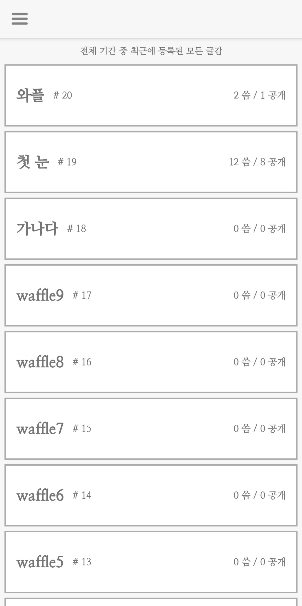
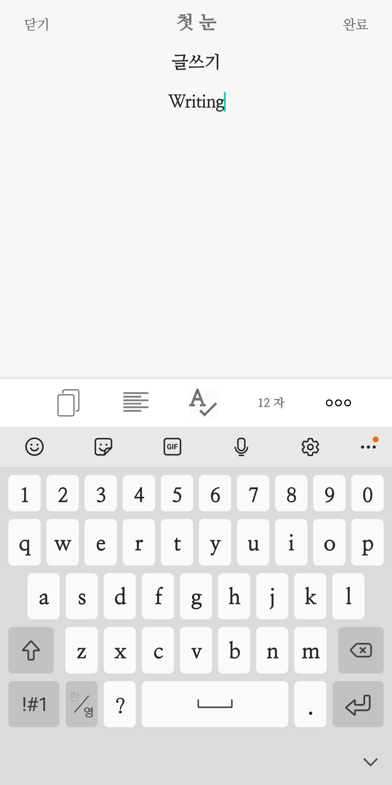

# team7-android
## '씀' clone coding
- This repository is about toy-project of [Wafflestudio](https://github.com/wafflestudio).
- We worked on this project in 2020.11.22 - 2021.01.09.
- The goal of this repo was to clone the service of '[씀](https://play.google.com/store/apps/details?id=com.projectm.ezbrother.ssm)'.
- Backend Server - [team7-server](https://github.com/wafflestudio18-5/team7-server).

## This App is using
- Kotlin
- Dependency Injection (with Dagger Hilt)
- MVVM Architecture
- Logging (with Timber)
- Retrofit2 & OkHttp3
- Rxjava3

## ScreenShots
    
